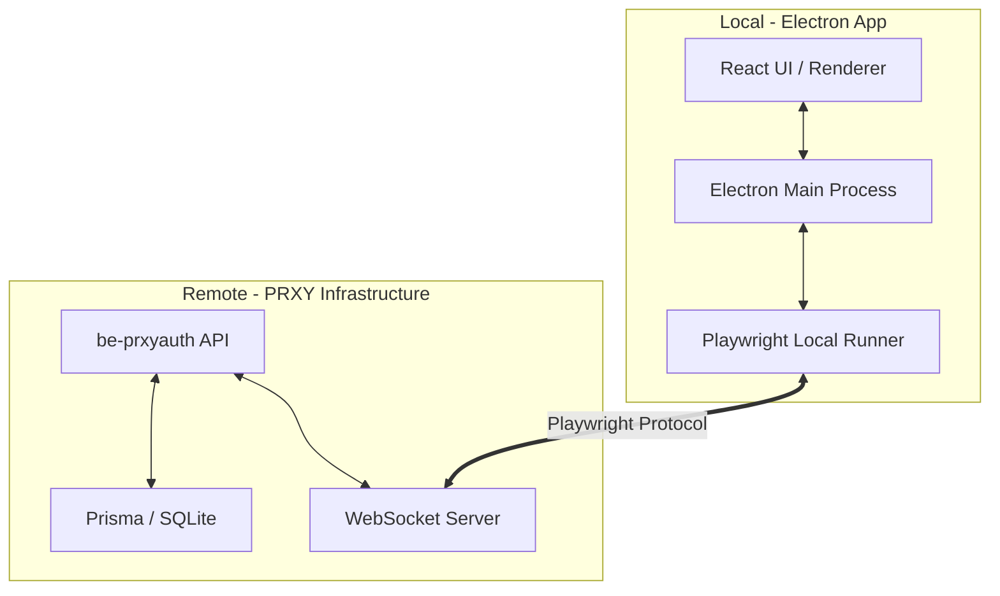

# PRXY Browser - Desktop Client

A premium Electron desktop application for managing secure automation sessions, purchasing infrastructure licenses, and controlling browser workers locally with proprietary stealth technology.

## Core Features

- **Infrastructure Marketplace**: Purchase and renew licenses for Google Cloud, Microsoft 365, and GitHub PRO.
- **Subscription Management**: Real-time tracking of license status, expiration dates, and plan types with premium UI cards.
- **Session Control**: Connect to and control remote Playwright sessions with high-fidelity browser interaction.
- **Stealth Integration**: Built-in bypass for common 2FA and bot detection systems.
- **VNC Support**: Direct headed browser access for manual interventions.

## Prerequisites

- Node.js 20+
- pnpm 10+
- be-prxyauth server reachable via API

## Installation

```bash
# Install dependencies
pnpm install

# Install Playwright browsers (one-time setup)
npx playwright install chromium
```

## Development

```bash
# Start both Vite dev server and Electron
pnpm electron:dev
```

## Building & Releasing

```bash
# Build for Windows locally
pnpm electron:build

# Release via GitHub Actions
# Bump version in package.json, then tag and push:
git tag v1.1.0
git push origin v1.1.0
```

The local executable will be generated in the `release` directory.

## Usage

1. **Configure Server**: Enter your API URL (default: `http://localhost:8000`).
2. **Authentication**: Login with your PRXY credentials.
3. **Marketplace**: Navigate to the Marketplace to view your active subscriptions or purchase new infrastructure nodes.
4. **Sessions**: Open the Dashboard to manage your active automation sessions and connect via the local runner.
5. **Subscriptions**: Monitor your license health directly in the Marketplace header.

## Architecture

PRXY Browser uses a distributed architecture to separate UI logic from heavy automation tasks.



## Security

- **AES-256 Encryption**: All session data and credentials are encrypted at rest and in transit.
- **MFA Isolation**: Each provider (Google, Office) runs in a strictly isolated environment.
- **JWT Authentication**: All API requests are secured with short-lived tokens.
